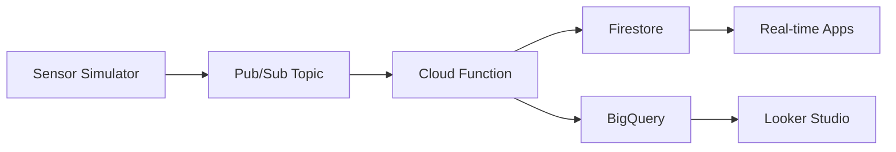

# IoT Real-time Data Processing System

## Google Cloud Platform Based Sensor Data Pipeline

A practical real-time IoT sensor data pipeline on GCP with serverless processing and live dashboard.

## 🎥 Project Walkthrough (YouTube) – 🇹🇷

📺 Watch the full development walkthrough and demo in Turkish:
🔗 [Project Video Link](https://youtu.be/YTwNlZJRh4k)

## **[View Live Dashboard](https://lookerstudio.google.com/reporting/95e13dc5-2708-4148-885f-037f6f775e4c/page/t2HMF)** - Real-time sensor data visualization

## 📋 **Table of Contents**

- [Overview](#overview)
- [Architecture](#architecture)
- [Features](#features)
- [Technology Stack](#technology-stack)
- [Getting Started](#getting-started)
- [Project Structure](#project-structure)
- [Deployment](#deployment)
- [Monitoring & Logging](#monitoring--logging)
- [Dashboard & Visualization](#dashboard--visualization)
- [Performance](#performance)
- [Security](#security)
- [Contributing](#contributing)

## 🎯 **Overview**

This project implements a scalable, real-time IoT sensor data processing pipeline using Google Cloud Platform services. The system simulates sensor data collection, processes it through serverless functions, stores it in multiple databases, and provides live visualization through an interactive dashboard.

### **Key Capabilities**

- ⚡ **Low-latency Ingestion**: with Google Pub/Sub
- 🔄 **Serverless Processing**: via Cloud Functions Gen2
- 💾 **Hybrid Storage**: Firestore (real-time) + BigQuery (analytics)
- 🎛️ **Threshold Filtering**: Ignores data changes <5% to reduce noise
- 📊 **Dashboard Insights**: Interactive Looker Studio visualization
- 🛡️ **Secure Access Control**: IAM-based permissions and service accounts

## 🏗️ **Architecture**



### **Data Flow**

1. **Sensor Simulator** generates temperature/humidity data every 5 seconds
2. **Pub/Sub** queues messages for reliable delivery
3. **Cloud Function** processes messages with intelligent filtering
4. **Dual Storage** ensures both real-time access and analytics capability
5. **Dashboard** provides live visualization and monitoring

## ✨ **Features**

### **Core Features**

- 🌡️ **Sensor Data Simulation**: Temperature (20-30°C) and Humidity (40-60%)
- 🔄 **Intelligent Filtering**: Only stores data with >5% change
- ⚡ **Serverless Processing**: Auto-scaling Cloud Functions Gen2
- 💾 **Multi-Database Storage**: Firestore + BigQuery integration
- 📊 **Real-time Dashboard**: Live charts and metrics

### **Advanced Features**

- 🛡️ **Error Handling**: Comprehensive exception management
- 📝 **Detailed Logging**: Execution tracking and debugging
- 🔐 **Security**: IAM roles and service account authentication
- 📈 **Performance Monitoring**: Cloud Functions metrics
- 🎯 **Cost Optimization**: Smart data filtering reduces storage costs

## 🛠️ **Technology Stack**

| Category           | Technology           | Purpose                      |
| ------------------ | -------------------- | ---------------------------- |
| **Backend**        | Python 3.13          | Core application logic       |
| **Messaging**      | Google Pub/Sub       | Asynchronous message queuing |
| **Compute**        | Cloud Functions Gen2 | Serverless data processing   |
| **Database**       | Cloud Firestore      | Real-time NoSQL database     |
| **Analytics**      | BigQuery             | Data warehouse and analytics |
| **Visualization**  | Looker Studio        | Interactive dashboard        |
| **Authentication** | Service Accounts     | Secure API access            |

## 🚀 **Getting Started**

### **Prerequisites**

- Google Cloud Platform account
- Python 3.13+
- Google Cloud CLI
- Virtual environment support

### **Installation**

1. **Clone the repository**

```bash
git clone https://github.com/your-username/iot-sensor-processing.git
cd iot-sensor-processing
```

2. **Set up virtual environment**

```bash
python -m venv venv
# Windows
.\venv\Scripts\activate
# macOS/Linux
source venv/bin/activate
```

3. **Install dependencies**

```bash
pip install -r requirements.txt
```

4. **Configure Google Cloud**

```bash
# Set up authentication
set GOOGLE_APPLICATION_CREDENTIALS=path/to/your/service-account-key.json

# Configure project
gcloud config set project your-project-id
```

5. **Deploy Cloud Function**

```bash
cd cloud_function_code
gcloud functions deploy process_sensor_data \
  --entry-point process_sensor_data \
  --runtime python313 \
  --trigger-topic iot-sensor-data \
  --region europe-west3
```

6. **Run sensor simulator**

```bash
python sensor_data_publisher.py
```

## 📁 **Project Structure**

```
iot-sensor-processing/
├── 📄 sensor_data_publisher.py          # Main sensor data simulator
├── 🔑 service-account-key.json          # GCP authentication key
├── 📁 cloud_function_code/              # Cloud Function source
│   ├── 📄 main.py                       # Function logic
│   └── 📄 requirements.txt              # Python dependencies
├── 📁 publisher_function/               # Alternative HTTP publisher
│   ├── 📄 main.py                       # HTTP trigger function
│   └── 📄 requirements.txt              # Dependencies
├── 📁 venv/                             # Python virtual environment
└── 📄 README.md                         # This file
```

## 🚀 **Deployment**

### **Cloud Function Deployment**

```bash
gcloud functions deploy process_sensor_data \
  --entry-point process_sensor_data \
  --runtime python313 \
  --trigger-topic iot-sensor-data \
  --region europe-west3 \
  --memory 256MB \
  --timeout 60s
```

### **Pub/Sub Topic Creation**

```bash
gcloud pubsub topics create iot-sensor-data
```

### **Firestore Database Setup**

1. Navigate to Firestore in GCP Console
2. Create database in Native mode
3. Choose region: `europe-west3`
4. Collection will be auto-created: `sensor_readings`

### **BigQuery Dataset Setup**

```sql
-- Create dataset
CREATE SCHEMA `sensora_dataset`;

-- Create table
CREATE TABLE `sensora_dataset.sensor_readings` (
  temperature FLOAT64,
  humidity FLOAT64,
  device_id STRING,
  timestamp TIMESTAMP
);
```

## 📊 **Dashboard & Visualization**

### **🎛️ [Live Dashboard](https://lookerstudio.google.com/reporting/95e13dc5-2708-4148-885f-037f6f775e4c/page/t2HMF)**

Our interactive Looker Studio dashboard provides:

#### **Key Metrics Cards**

- 🌡️ Current temperature reading
- 💧 Current humidity level
- ⏰ Last data received timestamp
- 📊 Total records count

#### **Time Series Charts**

- 📈 Temperature trend over time
- 💧 Humidity variation chart
- 🔄 Combined temperature + humidity correlation

#### **Interactive Features**

- 📅 Date range selector
- 🔍 Device ID filtering
- 🔄 Auto-refresh every 5 minutes
- 📱 Mobile-accessible interface (via Looker Studio)

## 📈 **Performance**

### **Optimization Features**

- 🎯 **Smart Filtering**: 5% change threshold reduces storage by ~60%
- ⚡ **Parallel Processing**: Simultaneous Firestore + BigQuery writes
- 🔄 **Auto-scaling**: Serverless functions scale with demand
- 💾 **Efficient Storage**: Optimized data structures

## 🔐 **Security**

### **Authentication & Authorization**

- 🔑 **Service Account**: Dedicated service account with minimal permissions
- 🛡️ **IAM Roles**: Principle of least privilege
- 🔐 **API Security**: Secure API key management
- 🌐 **Network Security**: VPC and firewall rules

### **Required IAM Roles**

```json
{
  "roles": [
    "roles/cloudfunctions.invoker",
    "roles/pubsub.publisher",
    "roles/datastore.user",
    "roles/bigquery.dataEditor"
  ]
}
```

## 📊 **Monitoring & Logging**

### **Cloud Function Monitoring**

- 📈 Invocation count and frequency
- ⏱️ Execution time metrics
- ❌ Error rate tracking
- 💾 Memory usage analysis

### **Logging Strategy**

```python
# Example log outputs
print(f"Received message: {sensor_data}")
print(f"Data saved to Firestore. Document ID: {doc_ref.id}")
print("Data inserted into BigQuery successfully.")
print("Change less than 5%, data not written.")
```

## 🔄 **Data Processing Logic**

### **Intelligent Filtering Algorithm**

```python
def changed(old, new):
    """Returns True if change is greater than 5%"""
    if old is None or old == 0:
        return True
    diff = abs(new - old) / abs(old) * 100
    return diff >= 5
```

### **Data Structure**

```json
{
  "temperature": 25.34,
  "humidity": 52.18,
  "device_id": "sensor-001",
  "timestamp": 1716590123
}
```

## 🧪 **Testing**

### **Local Testing**

```bash
# Test sensor simulator
python sensor_data_publisher.py

# Check Cloud Function logs
gcloud functions logs read process_sensor_data --region=europe-west3
```

### **Integration Testing**

1. ✅ Pub/Sub message publishing
2. ✅ Cloud Function trigger response
3. ✅ Firestore data persistence
4. ✅ BigQuery data insertion
5. ✅ Dashboard data visualization

## 🙏 **Acknowledgments**

- **Google Cloud Platform** for the cloud infrastructure
- **Looker Studio** for powerful data visualization capabilities
- **Cloud Functions** for serverless computing flexibility
- **Academic Project** developed for Cloud Technologies course

---

_This project showcases foundational cloud architecture principles and practical IoT data processing patterns._
